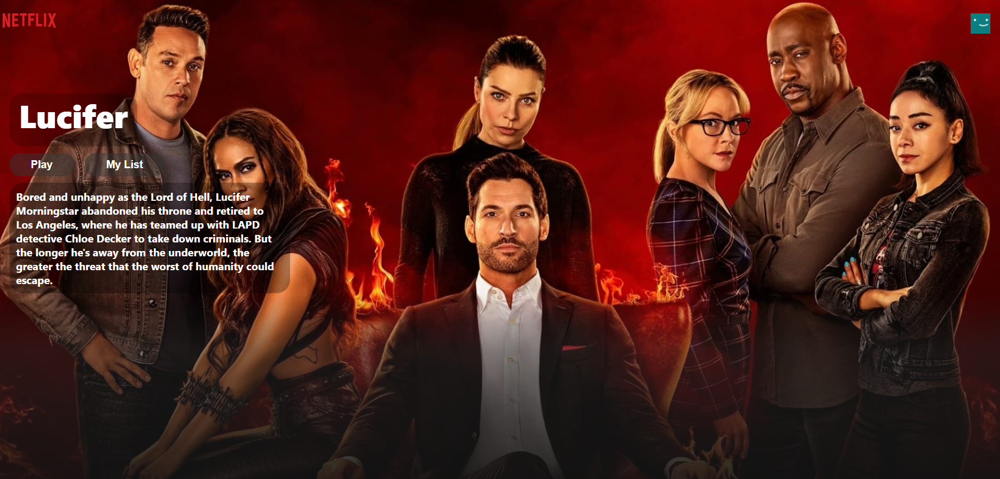
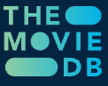
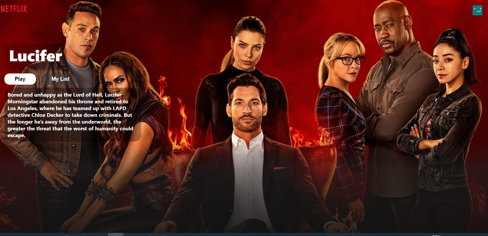
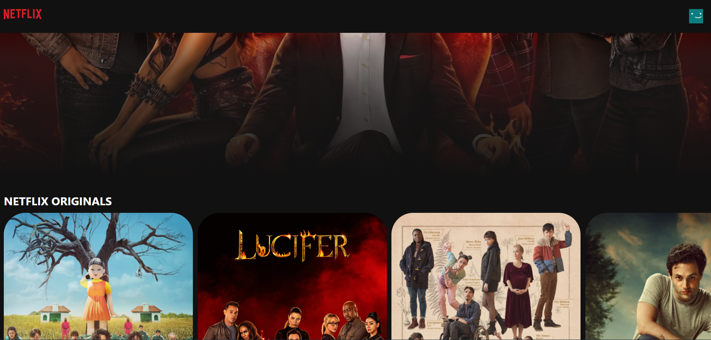
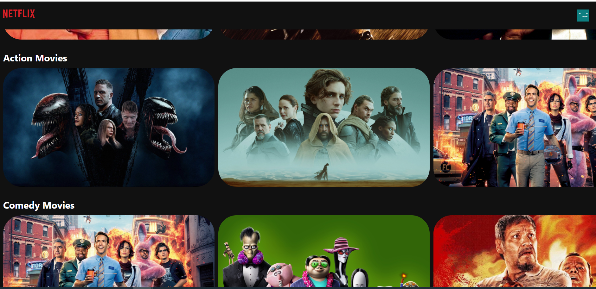
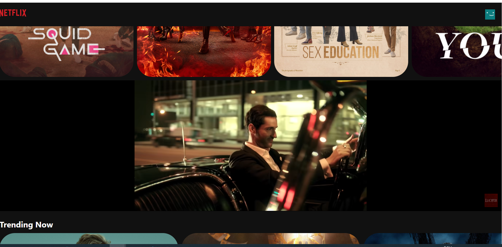

# Netflix clone React App

<p align="center">
    
</p>

This project cosists of a **React** app ⚛️ Which has as a theme, *The Netflix Desktop Website*. The app makes the use of modern **Functional components** and **React hooks**. The project is deployed using **Google Firebase**. The project makes the use of two APIs. **The Movie Database API** to fetch data about a particular movie and tv series and display the backdrop image and the description of that particular image and also to retrieve a list of movies and TV series depending on a category. The application containing **8** such categories. And **Google's YouTube Data API** to search and fetch the trailer corresponding to that specific movie after clicking on the movie's image card.

<br>

# Demo

The project is online:

<h3>

[LIVE DEMO HERE](https://netflix-clone-999.web.app/)

<br>

# Features

* Modern UI ✨
* Hovering over effect for the Play and My List buttons ⏯️
* Gradient fade effect at the bottom of the main hero image💫🦸‍♂️
* Transition to a solid sticky top bar navigation when scrolling throgh the page💫
* Opening trailer clip when clicking on one of the cards 🎥
* Transition effect animation when hovering over the movie card💫🏃
* Horisontal scroll for the movie cards ⬅️➡️
* Movies and TV series are displayed in categories:
    * Netflix originals
    * Trending now
    * Top rated
    * Action movies
    * Comedy movies
    * Horror movies
    * Romance movies
    * Documentaries

<br>

# Technologies used :
<br>
<h2> 

&nbsp;&nbsp;&nbsp;&nbsp;&nbsp;
* React  

&nbsp;&nbsp;&nbsp;&nbsp;&nbsp;&nbsp;&nbsp;
* Firebase Hosting  

&nbsp;&nbsp;&nbsp;&nbsp;&nbsp;&nbsp;

* The Movie Database API &nbsp;&nbsp;&nbsp; 

&nbsp;&nbsp;&nbsp;&nbsp;&nbsp;&nbsp;

* YouTube Data API &nbsp;&nbsp;&nbsp; 
</h1> 
<br>

# Gallery

<p align="center">
    
</p>
<p align="center">
    
</p>
<p align="center">
    
</p>
<p align="center">
    
</p>
<p align="center">
    
</p>

<br>
<br>


# To run the project locally

## Pre-requisites:
- node installed (e.g. version used: v14.15.1)
- npm installed (e.g. version used: 6.14.8)

## Steps:

1. Clone the repository
2. Open the command line in the project folder.
3. From the command line write the following comands in order:
```
npm i
npm start
```
4. If port 3000 is not in use, then the React app will start at:
- http://localhost:3000

### Have fun with project and thank you for your attention. 😊 😉
